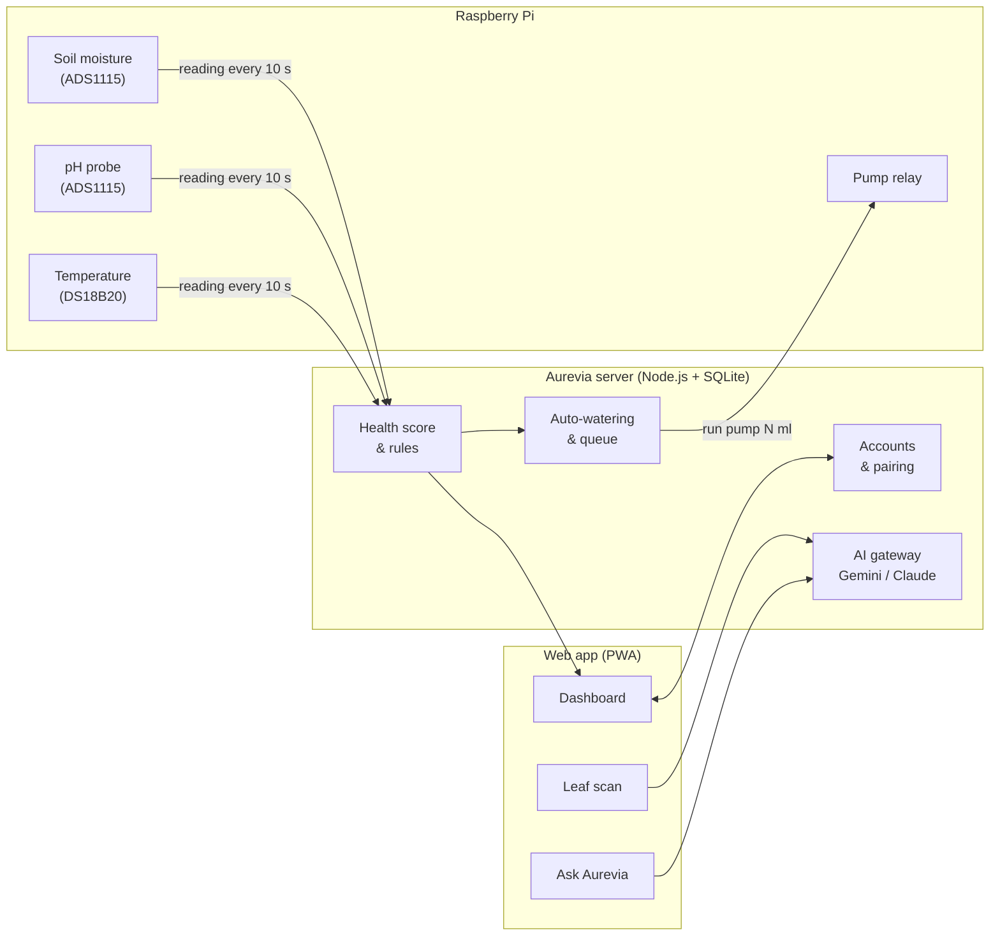

<div align="center">


# Aurevia

### The AI plant therapist that watches, diagnoses and waters, around the clock.

Live soil sensing · AI leaf diagnosis · Automatic irrigation · One installable web app

<br />

[](https://aurevia-swart-mu.vercel.app)
[](LICENSE)


<sub>Built by <a href="https://github.com/TECH-SUGATA"><b>Sugata Nayak</b></a> · AI Engineer &amp; Full-Stack Developer · Kolkata, India</sub>

</div>

---

## Table of contents

- [Why Aurevia](#why-aurevia)
- [Features](#features)
- [How it works](#how-it-works)
- [Tech stack](#tech-stack)
- [Quick start](#quick-start)
- [Deployment guide](#deployment-guide)
- [Connect a Raspberry Pi](#connect-a-raspberry-pi)
- [Hardware and wiring](#hardware-and-wiring)
- [Configuration](#configuration)
- [Health score](#health-score)
- [API reference](#api-reference)
- [Security](#security)
- [Project structure](#project-structure)
- [Testing](#testing)
- [Limitations](#limitations)
- [Roadmap](#roadmap)
- [License](#license)
- [Author](#author)

---

## Why Aurevia

Most houseplants do not die of neglect. They die of **too much or too little water**, and of diseases that are noticed too late. Aurevia closes that gap:

> **Sense** the soil every few seconds, **understand** it with rules and AI, **act** by running the pump, and **tell you** what happened in plain language.

It is a complete, multi-user product rather than a single-device demo. Anyone can create an account, pair their own Raspberry Pi with one command, and look after their plant from any phone, tablet or PC.

---

## Features

| | Feature | What you get |
|---|---|---|
| 📈 | **Live health monitoring** | Soil moisture, temperature and pH, with a single 0 to 100 health score and a clear status (Thriving, Needs care, Stressed). |
| 🍃 | **AI leaf diagnosis** | Upload a leaf photo and get a diagnosis, a confidence value, a severity level and short care steps. |
| 💧 | **Automatic watering** | The server orders the pump to run when moisture drops below the plant's threshold. Every watering is logged, with a cooldown between runs. |
| 🕹️ | **Water now** | Tap once in the app. The order is queued and delivered to the Pi with its next reading. |
| 💬 | **Plant care assistant** | Ask a question and get a short answer based on that plant's latest readings. |
| 🔌 | **One-command Pi setup** | A pairing code links a Pi to a user account. No manual API keys or config files. |
| 👥 | **Real multi-user accounts** | Every plant, reading and device is scoped to its owner and covered by tests. |
| 📱 | **Installable web app** | A PWA with a service worker, manifest and icons. Add it to the home screen. |
| 🛡️ | **Safe by default** | Hashed passwords, hashed device tokens, rate limits, cross-site write blocking and a hard cap on pump run time. |
| 🧪 | **Works without hardware** | A built-in `--simulate` mode and demo AI answers let you try everything with no sensors and no API key. |

---

## How it works



**The control loop**

1. Every **10 seconds** the Pi posts a reading to the server.
2. The server stores it, computes the health score and decides whether the plant needs water.
3. The reply can contain an order: *"run the pump for N ml"*. This happens either because moisture is below the plant's threshold (auto-watering) or because the user tapped **Water now**.
4. A watering is **logged only when the order is actually delivered** to the Pi.
5. The server then waits **30 minutes** before it will water the same plant automatically again.

---

## Tech stack

| Layer | Technology |
|---|---|
| **Server** | Node.js 20+, Express 4 |
| **Database** | SQLite through `better-sqlite3` |
| **Web app** | Plain HTML, CSS and JavaScript as a Progressive Web App (no build step) |
| **Device client** | Python 3, `gpiozero`, `lgpio`, Adafruit ADS1x15 |
| **AI** | Google Gemini (free tier available) or Anthropic Claude, chosen by which key you set |
| **HTTPS and hosting** | Docker Compose with Caddy, or Render for the backend and Vercel for the frontend |
| **Tests** | Node's built-in test runner |

---

## Quick start

### Try it locally in two minutes

```bash
git clone https://github.com/TECH-SUGATA/aurevia.git
cd aurevia/server
npm install
npm start
```

Open **http://localhost:3001**, create an account, and you have a working app.

> **Windows tip:** use Node.js **22 LTS**. Very new Node versions may have no prebuilt SQLite binary, which forces a native build.

### Simulate a plant (no hardware needed)

In a second terminal:

```bash
AUREVIA_SERVER=http://localhost:3001 python3 pi/aurevia_pi.py --simulate
```

The simulator prints a **pairing code**. Enter it in the app under **Me → Connect device** and live readings start flowing.

---

## Deployment guide

Pick the path that fits your budget.

### Option A: Docker on a VPS (production)

Best for a permanent, always-on instance with automatic HTTPS.

```bash
git clone https://github.com/TECH-SUGATA/aurevia.git && cd aurevia
cp .env.example .env        # set DOMAIN, GITHUB_REPO, INVITE_CODE and an AI key
docker compose up -d --build
```

Point a domain's **A record** at the server first. Caddy then obtains the HTTPS certificate on its own. Back up the `aurevia-data` Docker volume, because it holds the database.

### Option B: Render + Vercel (free demo)

| Part | Where | Setup |
|---|---|---|
| **Backend, database, AI** | [Render](https://render.com) | New Web Service, runtime **Docker**, plan **Free**. Add the environment variables from [Configuration](#configuration). |
| **Frontend** | [Vercel](https://vercel.com) | Import the repository, preset **Other**, root `./`. The included `vercel.json` serves `server/public` and proxies `/api/*` to Render. |

Before deploying the frontend, edit the `destination` URL in [`vercel.json`](vercel.json) so it points at **your** Render address.

> ⚠️ **Free-plan behaviour:** Render's free instances sleep when idle (the first request can take about a minute) and have no persistent disk, so the SQLite file resets on restart. This is fine for a demo and not for real users. For permanence use Option A, or add a paid persistent disk.

### Option C: Any Node host

Run `npm ci --omit=dev && node src/server.js` inside `server/` and set `TRUST_PROXY=1` when the app sits behind an HTTPS proxy, so cookies are marked `Secure`.

---

## Connect a Raspberry Pi

1. **Create an account** in the app (**Log in → New here? Create an account**).
2. **Wire your sensors** using the table in the next section.
3. **Run the installer** on the Pi. The **Me** tab shows this exact command with your server address filled in:
   ```bash
   curl -fsSL https://raw.githubusercontent.com/TECH-SUGATA/aurevia/main/pi/install.sh | \
     AUREVIA_REPO=https://github.com/TECH-SUGATA/aurevia.git \
     AUREVIA_SERVER=https://your-server bash
   ```
4. The Pi prints a **pairing code** (also in `journalctl -u aurevia-pi -f`).
5. In the app open **Me → Connect device**, enter the code and name your plant. Readings appear within seconds.

The installer sets up a Python virtual environment, enables I2C and 1-Wire, and installs a **systemd service** so the client starts on boot. Reboot once after the first install so I2C and 1-Wire are active.

To disconnect a Pi, press **Remove** in the app. The Pi then asks for a new pairing code.

---

## Hardware and wiring

**Supported boards:** Raspberry Pi 3, 4, 5 and Zero 2 W.

| Part | Purpose |
|---|---|
| ADS1115 ADC module | The Pi has no analog inputs, so this reads moisture and pH |
| Capacitive soil moisture sensor v1.2 | Soil moisture |
| pH probe and module (for example PH-4502C) | Soil pH |
| DS18B20 temperature sensor and 4.7 kΩ resistor | Temperature |
| 5 V relay module, small pump, tubing, tank | Watering |
| Separate 5 V supply for the pump | **Never power the pump from the Pi pins** |

| From | To |
|---|---|
| ADS1115 VDD / GND | Pi 3.3 V (pin 1) / GND (pin 6) |
| ADS1115 SDA / SCL | Pi pin 3 / pin 5 |
| Moisture sensor signal | ADS1115 **A0** (powered from 3.3 V) |
| pH module signal | ADS1115 **A1** (keep it under the ADS1115 supply voltage; use a voltage divider if the module outputs up to 5 V) |
| DS18B20 data | Pi pin 7 (GPIO4), with the 4.7 kΩ resistor between data and 3.3 V |
| Relay IN | Pi pin 11 (GPIO17); relay VCC to 5 V, GND to GND |
| Pump | Through the relay COM / NO terminals, on its own supply |

**Verify after rebooting:** `i2cdetect -y 1` should show `48`, and `ls /sys/bus/w1/devices` should list a `28-…` folder.

### Calibration

Edit `~/.aurevia/aurevia.env` on the Pi, then run `sudo systemctl restart aurevia-pi`.

| Variable | How to measure |
|---|---|
| `MOIST_DRY_V` / `MOIST_WET_V` | Sensor voltage in open air / in a glass of water |
| `PH_V7` / `PH_V4` | Voltage in pH 7.00 / pH 4.00 buffer solution |
| `ML_PER_SEC` | Time the pump filling a measuring cup |
| `PUMP_PIN`, `PUMP_ACTIVE_LOW` | Relay pin and polarity (most relay boards switch ON with LOW) |

> Test the pump with an **empty tube** first. A single watering is capped at **60 seconds** on the Pi.

---

## Configuration

All server settings are environment variables. Copy `.env.example` to `.env` (Docker) or set them in your host's dashboard.

| Variable | Default | Description |
|---|---|---|
| `DOMAIN` | - | Your domain. Used by Caddy for HTTPS (Docker deployment). |
| `INVITE_CODE` | *(empty)* | If set, sign-up requires this code. **Strongly recommended**, so strangers cannot spend your AI quota. |
| `GEMINI_API_KEY` | *(empty)* | Free key from [Google AI Studio](https://aistudio.google.com). Enables real leaf diagnosis and chat. |
| `GEMINI_MODEL` | `gemini-3.8-flash` | Gemini model name. The server retries when Google is busy and falls back to other models automatically. |
| `ANTHROPIC_API_KEY` | *(empty)* | Optional paid alternative. If set, it takes priority over Gemini. |
| `ANTHROPIC_MODEL` | `claude-sonnet-5-5` | Claude model name. |
| `AI_DAILY_LIMIT` | `30` | AI requests allowed per user per day. |
| `GITHUB_REPO` | *(empty)* | `owner/name`. Fills in the Pi install command shown in the app. |
| `PORT` | `3001` | HTTP port. |
| `DB_FILE` | `./data/aurevia.db` | Path of the SQLite database. |
| `TRUST_PROXY` | `0` | Set to `1` behind an HTTPS proxy (Caddy, Render, Nginx, Vercel rewrites). |

Without any AI key the app still works fully and returns clearly marked **demo** answers.

---

## Health score

Each reading is compared with a healthy range. The score starts at 100 and loses points in proportion to how far a value is outside its range, and it never drops below 20.

| Metric | Healthy range |
|---|---|
| Soil moisture | 45 – 70 % |
| Temperature | 18 – 28 °C |
| Soil pH | 5.8 – 7.0 |

| Score | Label |
|---|---|
| 75 and above | **Thriving** |
| 55 – 74 | **Needs care** |
| Below 55 | **Stressed** |

---

## API reference

All endpoints are under `/api`. Browser calls use an HttpOnly session cookie. Devices use a per-device token.

<details>
<summary><b>Accounts and session</b></summary>

| Method | Endpoint | Description |
|---|---|---|
| `POST` | `/auth/signup` | Create an account (invite code if required). Rate limited. |
| `POST` | `/auth/login` | Log in. Rate limited. |
| `POST` | `/auth/logout` | End the session. |
| `GET` | `/auth/me` | Current user. |
| `GET` | `/health` | Server status, AI availability and healthy ranges. |

</details>

<details>
<summary><b>Devices</b></summary>

| Method | Endpoint | Description |
|---|---|---|
| `POST` | `/device/register` | A Pi registers and receives a pairing code. |
| `POST` | `/device/readings` | A Pi posts a reading and receives any pump order. |
| `POST` | `/devices/claim` | A user claims a Pi with its pairing code. |
| `GET` | `/devices` | List the user's devices. |
| `DELETE` | `/devices/:id` | Remove a device and revoke its token. |

</details>

<details>
<summary><b>Plants and watering</b></summary>

| Method | Endpoint | Description |
|---|---|---|
| `GET` | `/plants` | List the user's plants with current status. |
| `GET` | `/plants/:id` | One plant. |
| `PUT` | `/plants/:id/settings` | Rename the plant, toggle auto-watering and set the dry threshold (10 to 60 %). |
| `DELETE` | `/plants/:id` | Remove a plant. |
| `GET` | `/plants/:id/readings` | Reading history (up to 500). |
| `POST` | `/plants/:id/water` | Queue a manual watering. |
| `POST` | `/plants/:id/refill` | Mark the water tank as refilled. |
| `GET` | `/plants/:id/watering` | Watering history. |

</details>

<details>
<summary><b>AI</b></summary>

| Method | Endpoint | Description |
|---|---|---|
| `POST` | `/scan` | Diagnose a leaf photo (JPEG, PNG or WebP, base64). |
| `POST` | `/chat` | Ask a plant-care question with the plant's latest readings as context. |

AI endpoints require a login and are rate limited per minute and per day.

</details>

---

## Security

Aurevia is built to be exposed to the internet, within the limits listed below.

- **Passwords** are hashed with scrypt.
- **Sessions** use HttpOnly, SameSite=Strict cookies, marked Secure behind HTTPS.
- **Cross-site writes are refused** by an Origin check.
- **Device tokens** are random secrets stored only as a hash on the server. Pairing codes are single use and expire after 1 hour.
- **Isolation:** every plant, reading and device is scoped to its owner. This is covered by automated tests.
- **Rate limits** apply to sign-up, login, device registration, pairing and AI calls.
- **Quotas:** up to 5 devices and 10 plants per user.
- **Pump safety:** a watering is capped at 60 seconds on the Pi, and the server enforces a 30-minute cooldown between automatic waterings.
- **Privacy:** leaf photos are sent to the AI provider only when a key is configured, and they are **not stored** on the server.

---

## Project structure

```text
aurevia/
├── server/                    Node.js API and web app
│   ├── src/
│   │   ├── server.js          Routes, auth, rate limits, watering logic
│   │   ├── db.js              SQLite schema and access
│   │   ├── health.js          Healthy ranges and score
│   │   └── ai.js              Gemini / Claude gateway with retry and fallback
│   ├── public/                Installable web app (PWA)
│   │   ├── index.html
│   │   ├── sw.js
│   │   └── manifest.webmanifest
│   └── test/api.test.js       Integration tests
├── pi/                        Raspberry Pi client
│   ├── aurevia_pi.py          Sensor loop, pairing, pump control
│   ├── install.sh             One-command installer
│   └── aurevia-pi.service     systemd unit
├── Dockerfile                 Server image
├── docker-compose.yml         Server and Caddy (automatic HTTPS)
├── Caddyfile
├── vercel.json                Static frontend and /api proxy for Vercel
└── LICENSE                    MIT
```

---

## Testing

```bash
cd server
npm install
npm test
```

The suite covers account creation and validation, Pi pairing, automatic and queued watering, **user data isolation**, device revocation, the AI fallback and cross-site request blocking.

---

## Limitations

Honest notes, so nothing surprises you:

- **Not included yet:** email verification, password reset and an admin panel. Keep `INVITE_CODE` set if you do not want open sign-up.
- **Single SQLite file.** This suits hundreds of users on one server. Move to PostgreSQL beyond that.
- **Free hosting resets data.** See the Render notes above.
- **Not a safety system.** This is a learning and hobby project. Do not rely on it for plants you cannot afford to lose.

---

## Roadmap

- [ ] Email verification and password reset
- [ ] Push notifications for low water and disease alerts
- [ ] Historical charts and CSV export
- [ ] Multiple sensor profiles per plant species
- [ ] PostgreSQL option for larger deployments
- [ ] Admin panel

Ideas and pull requests are welcome.

---

## License

Released under the [MIT License](LICENSE). © 2026 Sugata Nayak.

---

## Author

<div align="center">

**Sugata Nayak**
AI Engineer · Full-Stack Developer · Open-Source Contributor
Kolkata, India

[](https://github.com/TECH-SUGATA)
[](https://www.linkedin.com/in/sugata-nayak-343099322/)
[](https://tech-sugata.github.io/PORTFOLIO/#contact)
[](mailto:sugatanayak65@gmail.com)

<sub>If Aurevia helped or inspired you, please consider giving the repository a ⭐</sub>

</div>
